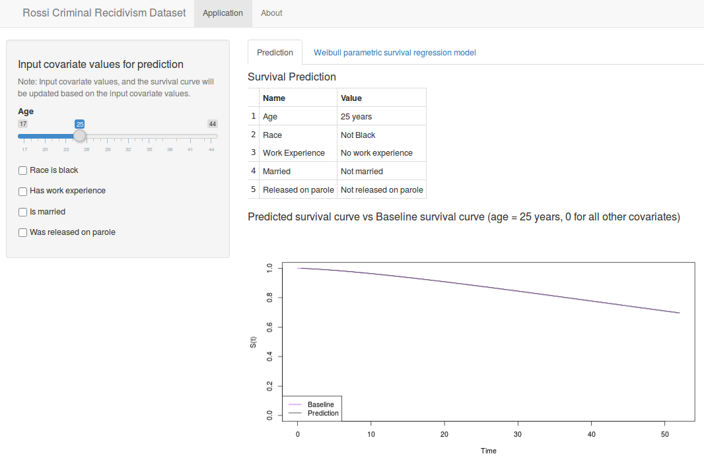

Developing Data Products
========================================================
date: 21 Feb 2015
Rossi Criminal Recidivism Dataset

Application Description
========================================================
This application allows the user to select covariate values of convicts to predict the recidivism survival curve. The application takes the following covariate inputs:  
- age
- race (Black or other)
- marital status
- work experience
- released on parole
  
The predicted survival curve is also plotted against a baseline curve.

The Data
========================================================
The application fits a Weibull parametric survival regression model to the [Rossi recidivism dataset](http://artax.karlin.mff.cuni.cz/r-help/library/RcmdrPlugin.survival/html/Rossi.html). The data pertains to 432 convicts who were released from Maryland state prisons in the 1970s and who were followed up for one year after release, with the outcome of interest being the time until the convicts returned to prison after release. The user inputs covariate values to obtain a prediction of the survival function based on the final model.

Data Summary
========================================================


```r
rossi <- read.table("../Rossi.txt", header=T)
rossi <- rossi[c("week", "arrest", "fin", "age", "race", "wexp", "mar", "paro")] # only keep subset of variables
str(rossi)
```

```
'data.frame':	432 obs. of  8 variables:
 $ week  : int  20 17 25 52 52 52 23 52 52 52 ...
 $ arrest: int  1 1 1 0 0 0 1 0 0 0 ...
 $ fin   : int  0 0 0 1 0 0 0 1 0 0 ...
 $ age   : int  27 18 19 23 19 24 25 21 22 20 ...
 $ race  : int  1 1 0 1 0 1 1 1 1 1 ...
 $ wexp  : int  0 0 1 1 1 1 1 1 0 1 ...
 $ mar   : int  0 0 0 1 0 0 1 0 0 0 ...
 $ paro  : int  1 1 1 1 1 0 1 1 0 0 ...
```

Application screenshot
========================================================

